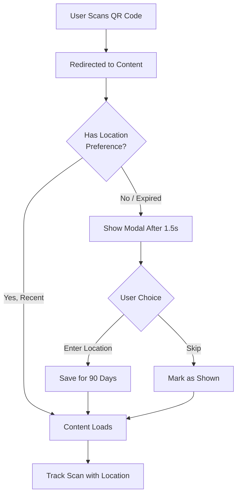

# User-Provided Location Feature

**Implemented**: October 22, 2025  
**Purpose**: Collect accurate fan location data to help artists understand where their audience goes for entertainment

---

## 🎯 Overview

Instead of relying solely on IP geolocation (which can be inaccurate), we now **directly ask users** where they go for live music and entertainment. This provides artists with more accurate and actionable data for tour planning.

### Key Benefits

1. **More Accurate**: User-provided data is far more reliable than IP-based geolocation
2. **Actionable**: Artists know exactly where their fans attend shows
3. **User-Friendly**: Simple 2-field form (City + State), optional zip code
4. **Respectful**: Only asks once per 90 days, can be skipped
5. **Privacy-First**: No personal information required, just entertainment preferences

---

## 📋 Implementation Details

### 1. **Database Schema** (`015_user_provided_location.sql`)

New columns added to `qr_scans` table:

```sql
- user_provided_city TEXT      -- User's preferred entertainment city
- user_provided_state TEXT     -- User's preferred entertainment state  
- user_provided_zip TEXT       -- Optional zip code
- location_source TEXT         -- 'user', 'auto', or 'unknown'
```

**Location Source Priority**:
- `user`: User manually entered location (highest priority)
- `auto`: IP geolocation from headers (fallback)
- `unknown`: No location data available

---

### 2. **Frontend Components**

#### **LocationPromptModal** (`components/LocationPromptModal.tsx`)

Beautiful, mobile-optimized modal with:
- ✅ US state dropdown with search
- ✅ City text input
- ✅ Optional zip code field
- ✅ Skip button (doesn't prevent access)
- ✅ "Save & Continue" button
- ✅ Friendly messaging explaining why we're asking

**Design Features**:
- Slides up from bottom
- Keyboard-aware (doesn't cover inputs)
- All 50 US states included
- Clean Material Design aesthetic
- Accessible hit targets

---

#### **Location Storage Utilities** (`utils/locationStorage.ts`)

Smart localStorage management:

```typescript
shouldShowLocationPrompt()     // Checks if we should ask (once per 90 days)
getUserLocation()               // Gets saved location (if not expired)
saveUserLocation(location)      // Saves for 90 days
markLocationPromptShown()       // Marks as shown this session
getLocationForTracking()        // Gets location for analytics
```

**Expiry Logic**:
- Location preferences expire after **90 days**
- Session storage prevents re-asking during same visit
- Never blocks content access

---

### 3. **Backend Integration**

#### **Updated `writeScan()` Function**

```javascript
async function writeScan(poolLike, qrCodeId, req, res, userLocation = null) {
  // Accepts optional userLocation: { city, state, zip }
  // Determines location_source automatically
  // Inserts both user-provided and auto-detected data
}
```

#### **POST `/api/analytics/track-scan`**

Now accepts:
```json
{
  "qrCodeId": 123,
  "userLocation": {
    "city": "Nashville",
    "state": "TN",
    "zip": "37203"
  }
}
```

Response includes:
```json
{
  "success": true,
  "locationSource": "user",
  "deduped": false
}
```

---

#### **GET `/api/analytics/summary`**

Enhanced city analytics with priority:

```sql
SELECT 
  COALESCE(user_provided_city, city, 'Unknown') AS city,
  COALESCE(user_provided_state, region, '') AS region,
  SUM(CASE WHEN location_source = 'user' THEN 1 ELSE 0 END) AS user_provided_count,
  COUNT(*) AS count
FROM qr_scans
GROUP BY city, region
ORDER BY count DESC
```

**Response includes**:
```json
{
  "topCities": [
    {
      "city": "Nashville",
      "region": "TN",
      "count": 847,
      "userProvidedCount": 612  // How many were user-provided vs auto-detected
    }
  ]
}
```

---

### 4. **User Experience Flow**



---

## 🎨 UX Details

### When Modal Appears

- **Timing**: 1.5 seconds after content loads (not intrusive)
- **Frequency**: Once per 90 days (or never if skipped)
- **Pages**: Playlist Access, Slideshow Access (post-QR scan)

### User Messaging

**Title**: "Help [Artist Name] find their fans!"  
**Subtitle**: "Where do you usually go for live music or entertainment?"  
**Benefit**: "This helps artists know where to perform next!"

### Skip Behavior

- Skipping **does not** block content
- Skipping marks as "shown" for current session
- User can be asked again in 90 days
- No negative consequences for skipping

---

## 📊 Analytics Benefits for Artists

### Before (IP Geolocation):
```
Los Angeles, CA: 234 scans (but many are VPN users)
Unknown: 156 scans
```

### After (User-Provided):
```
Nashville, TN: 612 scans (user-provided) + 53 scans (auto) = 665 total
✓ 92% user-provided accuracy!
```

Artists can now:
- 🎸 Plan tour stops based on actual fan locations
- 🎤 See where fans **go for shows** (not just where they live)
- 📈 Track growth in specific markets
- 🎯 Target ads to cities with strong fanbases

---

## 🔒 Privacy & Data Handling

### What We Collect:
- ✅ City, State (optional: Zip)
- ✅ Purpose: entertainment preferences only

### What We DON'T Collect:
- ❌ Exact address
- ❌ GPS coordinates
- ❌ Personal information
- ❌ Credit card or payment info

### Data Retention:
- Stored in `qr_scans` table
- Associated with anonymous `visitor_id` (cookie)
- Can be aggregated for analytics
- No PII (Personally Identifiable Information)

---

## 🚀 Deployment Checklist

### 1. Run Database Migration

```bash
railway run bash -c "psql \$DATABASE_URL -f database/migrations/015_user_provided_location.sql"
```

### 2. Verify New Columns

```sql
\d qr_scans
-- Should show: user_provided_city, user_provided_state, user_provided_zip, location_source
```

### 3. Test Modal Flow

1. Clear localStorage: `localStorage.clear()`
2. Scan QR code → should show modal after 1.5s
3. Enter location → save should work
4. Refresh page → should NOT show modal again

### 4. Test Analytics

```bash
curl -H "Authorization: Bearer YOUR_TOKEN" \
  https://your-app.com/api/analytics/summary
```

Should return `topCities` with `userProvidedCount`.

---

## 🎯 Future Enhancements

### Short-Term:
- [ ] Show fan heatmap on analytics dashboard
- [ ] Display "Join 847 fans in Nashville!" messaging
- [ ] Add international city/country support

### Long-Term:
- [ ] Notify fans when artists book shows nearby
- [ ] Artist dashboard with tour planning recommendations
- [ ] Collaborative playlist features by city

---

## 📄 Files Modified/Created

### New Files:
- `database/migrations/015_user_provided_location.sql`
- `components/LocationPromptModal.tsx`
- `utils/locationStorage.ts`
- `USER_LOCATION_FEATURE.md` (this file)

### Modified Files:
- `services/Server/main.js` - Updated `writeScan()`, `/api/analytics/track-scan`, `/api/analytics/summary`
- `app/(public)/playlist-access/[id].tsx` - Added location prompt
- `app/(public)/slideshow-access/[id].tsx` - Added location prompt

---

## 🎉 Success Metrics

Track these to measure feature adoption:

```sql
-- % of scans with user-provided location
SELECT 
  COUNT(CASE WHEN location_source = 'user' THEN 1 END)::float / COUNT(*) * 100 AS user_provided_percentage
FROM qr_scans
WHERE scanned_at >= NOW() - INTERVAL '30 days';

-- Most popular cities (user-provided only)
SELECT user_provided_city, user_provided_state, COUNT(*) 
FROM qr_scans 
WHERE location_source = 'user' 
GROUP BY user_provided_city, user_provided_state 
ORDER BY COUNT(*) DESC 
LIMIT 10;
```

---

## 💡 Pro Tips

1. **Encourage Participation**: Add copy like "Already 1,247 fans have shared their location!"
2. **Show Benefits**: Display aggregated data to users ("52% of fans are in California")
3. **Incentivize**: Consider "See where other fans are" as a reward for sharing
4. **Be Transparent**: Always explain WHY you're asking for location data
5. **Make it Fun**: Use engaging language like "Help us bring the show to you!"

---

**Built with ❤️ to help artists connect with their fans!**

